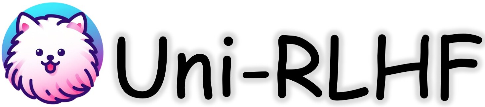

<!-- Improved compatibility of back to top link: See: https://github.com/othneildrew/Best-README-Template/pull/73 -->
<a name="readme-top"></a>
<!--
*** Thanks for checking out the Best-README-Template. If you have a suggestion
*** that would make this better, please fork the repo and create a pull request
*** or simply open an issue with the tag "enhancement".
*** Don't forget to give the project a star!
*** Thanks again! Now go create something AMAZING! :D
-->

<p align="center">
    <br>
    
    <br>
<p>

<p align="center">
    <a href="https://arxiv.org/abs/2402.02423">
        
    </a>
    <!-- <a href="">
        
    </a>
    <a href="">
        
    </a>
    <a href="">
        
    </a> -->
    <a href="">
        
    </a>
</p>

<p align="center">
<a href="https://uni-rlhf.github.io/">Project Website</a>
·
<a href="https://arxiv.org/abs/2402.02423">Paper</a>
·
<a href="https://drive.google.com/drive/folders/1JMWyl0iAm2JJ5pOBW5M9kTOj6pJn8H3N?usp=drive_link">Datasets</a>
·
<a href="https://github.com/pickxiguapi/Clean-Offline-RLHF">Clean Offline RLHF</a>
</p>

This is the **Uni-RLHF** platform implementation of the paper ***Uni-RLHF: Universal Platform and Benchmark Suite for Reinforcement Learning with Diverse Human Feedback*** by [Yifu Yuan](https://yifu-yuan.github.io/), [Jianye Hao](http://www.icdai.org/jianye.html), [Yi Ma](https://mayi1996.top/), [Zibin Dong](https://zibindong.github.io/), [Hebin Liang](), [Jinyi Liu](), [Zhixin Feng](), [Kai Zhao](), [Yan Zheng](https://yanzzzzz.github.io/). Uni-RLHF aims
to provide a complete workflow from *real human feedback*, fostering progress in the development of RLHF in decision making domain. Here we develops a user-friendly annotation interface tailored to various feedback types, compatible with a wide range of mainstream RL environments. We then establish a systematic pipeline of crowdsourced annotations, resulting in [**large-scale annotated dataset**](https://drive.google.com/drive/folders/1JMWyl0iAm2JJ5pOBW5M9kTOj6pJn8H3N?usp=drive_link) (≈15 million steps). Also, we provide **offline RLHF baselines** using collected feedback datasets and various design choice in the [Clean Offline RLHF](https://github.com/pickxiguapi/Clean-Offline-RLHF).

## Important note: This repository only contains code related to the annotation platform. For related datasets and model training code, please refer to: [Clean-Offline-RLHF](https://github.com/pickxiguapi/Clean-Offline-RLHF). 

<p align="center">
    <br>
    
    <br>
<p>
    
<!-- TABLE OF CONTENTS -->
<details>
  <summary>Table of Contents</summary>
<ol>
<li>
  <a href="#getting-started">Getting Started</a>
  <ul>
    <li><a href="#prerequisites">Prerequisites</a></li>
    <li><a href="#installation">Installation</a></li>
  </ul>
</li>
<li><a href="#usage">Usage</a></li>
<li><a href="#roadmap">Roadmap</a></li>
<li><a href="#contributing">Contributing</a></li>
<li><a href="#license">License</a></li>
<li><a href="#contact">Contact</a></li>
<li><a href="#acknowledgments">Acknowledgments</a></li>
</ol>
</details>


<!-- GETTING STARTED -->
## 🛠️ Getting Started

The Uni-RLHF platform consists of a vue front-end and a flask back-end. Also, we support a wide range of mainstream RL environments for annotation.

### Installation

#### Platform

1. Clone the repo
   ```sh
   git clone https://github.com/TJU-DRL-LAB/Uni-RLHF.git
   cd Uni-RLHF
   ```
2. Install virtualenv
    ```sh
    conda create -n rlhf python==3.9
    conda activate rlhf
    pip install -r requirements.txt
    ```
3. Install NPM packages
   ```sh
   npm install --prefix ./uni_rlhf/vue_part
   ```
5. Configure a MySQL Database

#### Datasets

Uni-RLHF supports the following classic datasets, a full list of all tasks is [available here](). Uni-RLHF also supports the uploading of customizaton datasets, as long as the dataset contains `observations` and `terminals` keys.

* Install [D4RL](https://github.com/Farama-Foundation/D4RL) dependencies. Note that we made some small changes to the camera view for better visualisations.
   ```sh  
   cd d4rl
   pip install -e .
   ```
* Install [Atari](https://github.com/takuseno/d4rl-atari) dependencies.
   ```sh  
   pip install git+https://github.com/takuseno/d4rl-atari
   ```
* Install [V-D4RL](https://github.com/conglu1997/v-d4rl) dependencies. Note that v-d4rl provide image datasets and full datasets can be found on [GoogleDrive](https://drive.google.com/drive/folders/15HpW6nlJexJP5A4ygGk-1plqt9XdcWGI). **These must be downloaded before running the code.** And the right file structure is:  
   ```sh  
    uni_rlhf
    └───datasets
    │   └───dataset_resource
    |       └───vd4rl
    |       |   └───cheetah
    |       |   │   └───cheetah_run_medium
    |       |   │   └───cheetah_run_medium_expert
    |       |   └───humanoid
    |       |   |   |───humanoid_walk_medium
    |       |   │   └───humanoid_walk_medium_expert
    |       |   └───walker
    |       |       |───walker_walk_medium
    |       |       └───walker_walk_medium_expert
    |       └───smarts
    |          └───cruise
    |          └───curin
    |          └───left_c
    └───vue_part
    │   ...
    └───controllers
    │   ...
   ```
* Install [MiniGrid](https://github.com/Farama-Foundation/Minigrid) dependencies. There are the same dependencies as the D4RL datasets.  
* Install [SMARTS](https://github.com/huawei-noah/SMARTS/tree/master) dependencies. We employed online reinforcement learning algorithms to train two agents for datasets collection, each designed specifically for the respective scenario. The first agent demonstrates medium driving proficiency, achieving a success rate ranging from 40% to 80% in its designated scenario. In contrast, the second agent exhibits expert-level performance, attaining a success rate of 95% or higher in the same scenario. For dataset construction, 800 driving trajectories were collected using the intermediate agent, while an additional 200 were gathered via
the expert agent. By integrating the two datasets, **we compiled a mixed dataset encompassing 1,000 driving trajectories.** We upload full datasets containing image (for rendering) and vector (for training) on [GoogleDrive]( https://drive.google.com/file/d/1_KNH8EziubY2s3r6ySSSzLKnlXexInPp/view). **These must be downloaded before running the code.** And the right file structure is the same as v-d4rl dataset.
* Upload customization datasets. The customization datasets must be `h5df` format and contain `observations` and `terminal` keys:

    ```sh
    observations: An N by observation dimensional array of observations.
    terminals: An N dimensional array of episode termination flags. 
    ```

<p align="right">(<a href="#readme-top">back to top</a>)</p>

<!-- #### Docker

We also provide a Dockerfile for easy installation. You can build the docker image by running

   ```sh
   cd docker && docker build . -t <user>/uni-rlhf:0.1.0
   ``` -->

#### Setup

To run the platform, you should configure `SQLALCHEMY_DATABASE` in the `uni_rlhf/config.py`, then run with:        

   ```python3 
   python run.py
   ```
App is running at: 
   ```python3 
   http://localhost:5001
   ```
You can kill all relative process with:
   ```python3 
   python scripts/kill_process.py
   ```

<!-- USAGE EXAMPLES -->
## 💻 Usage

### Overview

<p align="center">
    <br>
    
    <br>
<p>

- **Specially tailored pipelines and tasks** for reinforcement learning and decision-making problem.  
- A clean pipeline designed for **employer-annotators coordination**
- Supports **multi-user synchronised labeling and export** with no conflict.   
- Supports a **large number of mainstream decision-making datasets** and easily cumstomize and upload your own datasets.   
- Supports **serveral mainstream feedback types for decision making problem** and provide configurable label formats let you combining new ways of giving feedback.    

### Supported Tasks

We support serveral build-in environments and datasets. See [config](clean-rlhf/uni-rlhf/uni_rlhf/dataset_validator/default_configuration.json) for expected name formatting for full domains and tasks.

### Supported Feedbacks Format

<p align="center">
    <br>
    
    <br>
<p>

We support five common feedback types, propose a standardized feedback encoding format how annotators interact with these types
and how they can be encoded. Additionally, we briefly outline the potential forms and applications of reinforcement learning that integrate various forms of human feedback in the Uni-RLHF paper.

### Offline RLHF Datasets and Benchmark

Thanks to Uni-RLHF, we establish a systematic pipeline of crowdsourced annotations, resulting in an open-source and reuseable [**large-scale annotated dataset**](https://drive.google.com/drive/folders/1JMWyl0iAm2JJ5pOBW5M9kTOj6pJn8H3N?usp=drive_link) (≈15 million steps). Then, we conduct offline RL baselines using collected feedback datasets, we refer to **offline RLHF baselines** in the [sister repository](https://github.com/pickxiguapi/Clean-Offline-RLHF). **We wish to
build valuable open-source platforms, datasets, and baselines to facilitate the development of more robust and reliable RLHF solutions for decision making based on realistic human feedback.**

_For more examples, please refer to the [Documentation](https://example.com)_

<p align="right">(<a href="#readme-top">back to top</a>)</p>


<!-- ROADMAP -->
## 🧭 Roadmap

- [ ] Support auto reward model training process
- [ ] Fix online training bug 
- [ ] Adapting the sampler in the new code framework

See the [open issues](https://github.com/github_username/repo_name/issues) for a full list of proposed features (and known issues).

<p align="right">(<a href="#readme-top">back to top</a>)</p>

<!-- CONTRIBUTING -->
## 🙏 Contributing

Contributions are what make the open source community such an amazing place to learn, inspire, and create. Any contributions you make are **greatly appreciated**.

If you have a suggestion that would make this better, please fork the repo and create a pull request. You can also simply open an issue with the tag "enhancement".
Don't forget to give the project a star! Thanks again!

1. Fork the Project
2. Create your Feature Branch (`git checkout -b feature/AmazingFeature`)
3. Commit your Changes (`git commit -m 'Add some AmazingFeature'`)
4. Push to the Branch (`git push origin feature/AmazingFeature`)
5. Open a Pull Request

<p align="right">(<a href="#readme-top">back to top</a>)</p>

<!-- LICENSE -->
## 🏷️ License

Distributed under the MIT License. See `LICENSE.txt` for more information.

<p align="right">(<a href="#readme-top">back to top</a>)</p>

<!-- CONTACT -->
## ✉️ Contact

For any questions, please feel free to email yuanyf@tju.edu.cn.

<p align="right">(<a href="#readme-top">back to top</a>)</p>

## 📝 Citation

If you find our work useful, please consider citing:
```
@inproceedings{anonymous2023unirlhf,
    title={Uni-{RLHF}: Universal Platform and Benchmark Suite for Reinforcement Learning with Diverse Human Feedback},
    author={Yuan, Yifu and Hao, Jianye and Ma, Yi and Dong, Zibin and Liang, Hebin and Liu, Jinyi and Feng, Zhixin and Zhao, Kai and Zheng, Yan}
    booktitle={The Twelfth International Conference on Learning Representations, ICLR},
    year={2024},
    url={https://openreview.net/forum?id=WesY0H9ghM},
}
```

<p align="right">(<a href="#readme-top">back to top</a>)</p>

<!-- ACKNOWLEDGMENTS
## Acknowledgments

* []()
* []()
* []() -->


<!-- MARKDOWN LINKS & IMAGES -->
<!-- https://www.markdownguide.org/basic-syntax/#reference-style-links -->
[contributors-shield]: https://img.shields.io/github/contributors/github_username/repo_name.svg?style=for-the-badge
[contributors-url]: https://github.com/github_username/repo_name/graphs/contributors
[forks-shield]: https://img.shields.io/github/forks/github_username/repo_name.svg?style=for-the-badge
[forks-url]: https://github.com/github_username/repo_name/network/members
[stars-shield]: https://img.shields.io/github/stars/github_username/repo_name.svg?style=for-the-badge
[stars-url]: https://github.com/github_username/repo_name/stargazers
[issues-shield]: https://img.shields.io/github/issues/github_username/repo_name.svg?style=for-the-badge
[issues-url]: https://github.com/github_username/repo_name/issues
[license-shield]: https://img.shields.io/github/license/github_username/repo_name.svg?style=for-the-badge
[license-url]: https://github.com/github_username/repo_name/blob/master/LICENSE.txt
[linkedin-shield]: https://img.shields.io/badge/-LinkedIn-black.svg?style=for-the-badge&logo=linkedin&colorB=555
[linkedin-url]: https://linkedin.com/in/linkedin_username
[product-screenshot]: images/screenshot.png
[Next.js]: https://img.shields.io/badge/next.js-000000?style=for-the-badge&logo=nextdotjs&logoColor=white
[Next-url]: https://nextjs.org/
[React.js]: https://img.shields.io/badge/React-20232A?style=for-the-badge&logo=react&logoColor=61DAFB
[React-url]: https://reactjs.org/
[Vue.js]: https://img.shields.io/badge/Vue.js-35495E?style=for-the-badge&logo=vuedotjs&logoColor=4FC08D
[Vue-url]: https://vuejs.org/
[Angular.io]: https://img.shields.io/badge/Angular-DD0031?style=for-the-badge&logo=angular&logoColor=white
[Angular-url]: https://angular.io/
[Svelte.dev]: https://img.shields.io/badge/Svelte-4A4A55?style=for-the-badge&logo=svelte&logoColor=FF3E00
[Svelte-url]: https://svelte.dev/
[Laravel.com]: https://img.shields.io/badge/Laravel-FF2D20?style=for-the-badge&logo=laravel&logoColor=white
[Laravel-url]: https://laravel.com
[Bootstrap.com]: https://img.shields.io/badge/Bootstrap-563D7C?style=for-the-badge&logo=bootstrap&logoColor=white
[Bootstrap-url]: https://getbootstrap.com
[JQuery.com]: https://img.shields.io/badge/jQuery-0769AD?style=for-the-badge&logo=jquery&logoColor=white
[JQuery-url]: https://jquery.com 
